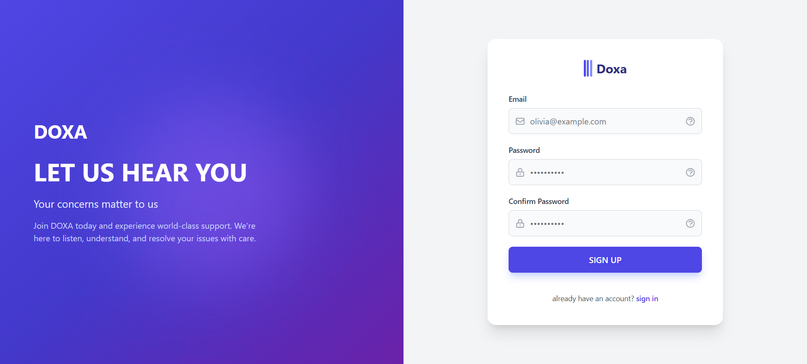

# DOXA
> AI-assisted intelligent ticketing and collaboration platform.


## Project Overview

DOXA is an intelligent ticketing system designed to address the challenges of high-volume customer support. By integrating advanced AI agents into the support workflow, DOXA reduces response times, ensures consistency, and optimizes human agent allocation.

The platform serves three distinct roles:
- **Clients** receive instant, accurate AI-generated responses for common queries.
- **Support Agents** focus on complex, high-value issues that require human intervention.
- **Administrators** gain visibility into system performance and knowledge base effectiveness.

This project demonstrates a practical application of Retrieval-Augmented Generation (RAG) and multi-agent orchestration in a production-like environment.

## Key Features

### Client
- **Smart Ticket Creation**: Intuitive interface for submitting support requests.
- **Instant AI Responses**: Immediate, context-aware answers derived from the knowledge base.
- **Status Tracking**: Real-time visibility into ticket progress (Open, AI Answered, Escalated, Closed).
- **Feedback Loop**: Ability to rate AI responses, driving continuous system improvement.

### Agent
- **Escalation Management**: Dedicated workspace for handling tickets that require human expertise.
- **AI Assistance**: Review AI-generated drafts and confidence scores before responding.
- **Contextual History**: Full access to previous interactions and automated attempts.

### Admin
- **Knowledge Base Management**: Tools to maintain and update the source of truth for AI agents.
- **Performance Metrics**: Dashboard for monitoring resolution rates, response times, and AI accuracy.

## Architecture Overview

DOXA follows a modern microservices-inspired architecture:

1.  **Frontend**: A responsive Single Page Application (SPA) built with React, providing role-based interfaces.
2.  **Backend**: A robust REST API built with FastAPI, handling business logic, user authentication, and data persistence.
3.  **AI Service**: A specialized autonomous agent service powered by AgentOS/Agno and Mistral LLM. It handles intent classification, RAG, and response generation.
4.  **Database**: PostgreSQL serves as the primary data store for users, tickets, and knowledge base embeddings.

The services communicate via RESTful HTTP endpoints, ensuring loose coupling and independent scalability.

## Tech Stack

### Frontend
- **Framework**: React 18 (Vite)
- **Styling**: Tailwind CSS
- **State/Networking**: Axios, React Router
- **Language**: TypeScript

### Backend
- **Framework**: FastAPI (Python)
- **Database**: PostgreSQL
- **ORM**: SQLAlchemy / Alembic (Migrations)
- **Authentication**: JWT (JSON Web Tokens)

### AI / Agentic
- **Orchestration**: AgentOS / Agno
- **LLM**: Mistral AI
- **Technique**: RAG (Retrieval-Augmented Generation)
- **Vector Search**: Local embedding processing

## Screenshots


.png)
.png)
.png)
.png)

## Getting Started

### Prerequisites
- Python 3.10+
- Node.js 18+
- PostgreSQL 15+

### Environment Configuration
Create a `.env` file in the root directory (or in respective service folders) based on `.env.example`. Key variables include:
- `DATABASE_URL`: Connection string for PostgreSQL.
- `MISTRAL_API_KEY`: API key for the LLM service.
- `JWT_SECRET`: Secret key for token generation.

### Quick Start (All Services)
We provide convenience scripts to launch the entire stack:

**Windows:**
```cmd
run.bat [YOUR_LOCAL_IP]
```

**Linux / macOS:**
```bash
chmod +x run.sh
./run.sh [YOUR_LOCAL_IP]
```

### Manual Setup

**1. Backend**
```bash
cd backend
# Activate virtual environment
uvicorn app.main:app --reload --port 8000
```

**2. AI Service**
```bash
cd ai
# Activate virtual environment
python agentoss_server_v2.py --port 7777
```

**3. Frontend**
```bash
cd frontend
npm install
npm run dev
```

## Demo & Use Cases

**Typical Flow:**
1.  **Client** logs in and submits a ticket regarding a technical issue.
2.  **AI Agent** analyzes the intent, searches the Knowledge Base, and drafts a response.
3.  If confidence is **high**, the AI responds directly.
4.  If confidence is **low**, the ticket is **escalated** to a human agent.
5.  **Agent** reviews the ticket, edits the AI draft if needed, and sends the final reply.

**Live Demo Recommendation:**
Start by submitting a query known to be in the Knowledge Base to demonstrate instant AI resolution. Then, submit an ambiguous or complex query to showcase the seamless escalation workflow.

## Project Structure

- `/frontend`: React-based user interface code.
- `/backend`: Core API logic and database models.
- `/ai`: Agent definitions, prompt engineering, and RAG pipeline.
- `/docs`: Architectural diagrams and functional specifications.
- `/img`: Project screenshots and assets.

## Hackathon Context

This project was architected and built during a 48-hour hackathon. The focus was on delivering a functional, end-to-end architecture that demonstrates the viability of AI agents in enterprise workflows. While the core flows are robust, some edge cases and production hardening features may be pending.

## License

This project is created for educational and demonstration purposes. It is not intended for production use without further security and scalability enhancements.
